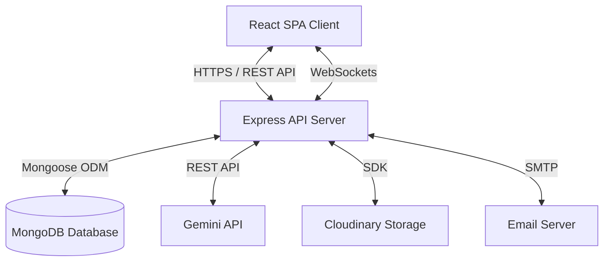

# Project Implementation Plan: Enterprise Workforce Management Platform with AI Operations Assistant

## 1. Project Overview
The **Enterprise Workforce Management Platform with AI Operations Assistant** is a unified, scalable system designed to automate human resources, recruitment, attendance tracking, leave requests, payroll processing, performance reviews, project tasks, asset allocations, helpdesk ticketing, and reporting. 

Additionally, the platform integrates an **AI Operations Assistant** to query employee records, forecast staffing needs, analyze candidate resumes, suggest performance feedback, and answer policy questions.

---

## 2. Technology Stack
The platform leverages a modern, unified JavaScript/TypeScript stack:

### Frontend Client
- **Runtime & Library:** React 19 (Functional components, Hooks, and Concurrent rendering features)
- **Tooling:** Vite + TypeScript
- **Styling:** Tailwind CSS v4 (native CSS import compiler integration, zero-config styling utility)
- **Routing:** React Router DOM (v6, BrowserRouter with nested routing)
- **HTTP Client:** Axios (configured with base instance, credentials, and interceptors)
- **Forms & Validation:** React Hook Form + Zod (for validation schemas)
- **Icons:** Lucide React

### Backend API Server
- **Runtime:** Node.js (v18+) with TypeScript
- **Framework:** Express.js (v4.x)
- **Database client:** Mongoose (MongoDB ODM)
- **Real-Time Communication:** Socket.IO
- **Services:**
  - **Cloudinary:** Media asset storage (resumes, avatar images, inventory attachments)
  - **Nodemailer:** Automated notification emails
  - **Gemini API:** Generative AI assistant processing and intelligence

### Database
- **Engine:** MongoDB (document-based, schema-less but constrained at ODM level via Mongoose)

---

## 3. Overall Architecture
The system employs a multi-tier client-server architecture:



---

## 4. Frontend Architecture
The client code is built using a **Feature-Based Directory Structure** rather than purely page-based layouts to enable high-concurrency development for 4 developers.

### Core Architecture
- **Features Module (`src/features/`)**: Each domain (e.g. `auth`, `leave`, `payroll`) is isolated:
  - `components/`: UI components (cards, headers) specific to that feature.
  - `pages/`: Page level components mapped to routers.
  - `hooks/`: Domain hooks containing state logic.
  - `services/`: Axios HTTP calls specific to this module.
  - `types/`: Domain-specific TypeScript declarations.
  - `utils/`: Custom helpers specific to this module.
- **Shared Layouts (`src/components/layout/`)**: Houses Sidebar, Header, Page wrapper, and global layout grids.
- **Global Components (`src/components/ui/` or `common/`)**: Reusable atomic UI (Buttons, Inputs, Modals, Tables, Charts).
- **Context API (`src/context/`)**: Manages app-wide shared state such as authenticated user objects.

---

## 5. Backend Architecture
The backend is structured into a modular **Layered Architecture** utilizing Express controllers, routing groups, and Mongoose schemas:

- **Routing Layer (`src/routes/`)**: Receives requests, applies middleware, and points to the appropriate controller.
- **Controller Layer (`src/controllers/`)**: Extracts request inputs, coordinates business logic, maps validation parameters, and issues HTTP responses.
- **Validation Layer (`src/validators/` or model-level validation)**: Runs schema validation (using Zod or Mongoose hooks) on request payloads before controller entry.
- **Middleware Layer (`src/middleware/`)**: Performs authentication checks, authorization parsing, fallback 404 routers, and global error capturing.
- **Service Layer (`src/services/`)**: Interfaces with external modules (Nodemailer, Cloudinary, Gemini AI client).
- **Data Access Layer (`src/database/` & `src/models/`)**: Manages MongoDB connections and model mapping.

---

## 6. Database Architecture
Mongoose coordinates constraints on the MongoDB schema. Relational mapping is managed through Object ID referencing (`mongoose.Schema.Types.ObjectId`).

- **Reference Linking**: Data collections utilize referencing (e.g., `Employee` links to `Department` via `deptId`).
- **Indices**: Indexes will be applied to lookup fields like `email`, `employeeId`, and compound search terms (`employeeId` + `date` in Attendance).
- **Audit Logs**: Changes to critical collections (Payroll, Performance, Leaves) are tracked asynchronously via database triggers or Mongoose middlewares saving to `AuditLog`.

---

## 7. AI Integration Architecture
AI functionality utilizes the Google Gemini API:
- **Client Prompting**: The frontend dispatches custom requests to backend endpoints (`/api/ai/ask`, `/api/ai/analyze-resume`).
- **Prompt Engineering**: The backend parses the query, fetches the relevant contextual data from MongoDB (e.g. policy text or candidate details), constructs a contextual prompt, and sends it to the Gemini SDK.
- **Security Scopes**: The backend validates that the requesting user's RBAC role matches the security context of the target prompt to prevent data leakage.

---

## 8. Authentication Strategy
Security is implemented using a stateless JSON Web Token (JWT) architecture:

```text
User Logs in  --->  Backend Validates  ---> Generates JWT & Refresh Token ---> Tokens Returned to Client
Client requests ---> Attaches JWT Bearer Header ---> Middleware verifies ---> Grants Resource Access
Token expires ---> Client requests '/refresh' ---> Validates Refresh Token ---> Issues New JWT
```

- **Tokens Storage**: Access tokens are stored in memory or local storage, and the Refresh token is stored in an HTTP-only secure cookie or a structured DB collection.
- **Encryption**: Passwords are encrypted before database insertion using `bcryptjs` with 10 salt rounds.

---

## 9. Shared Resources
To prevent duplicate code, the team uses:
- **Global Types (`frontend/src/types` & `backend/src/types`)**: Common interfaces for database objects (e.g. `User`, `ApiResponse`).
- **Global Contexts (`frontend/src/context`)**: Authentication, theme, and real-time notification states.
- **Global Helper Functions (`frontend/src/utils/helpers.ts`)**: Currency formatting (`formatCurrency`), date conversion (`formatDate`), and permission authorization checks.

---

## 10. Development Standards
- **Strong Typing**: All files must use strict TypeScript configurations. Avoid using `any`; create interface definitions for all response properties.
- **Functional React**: React 19 elements must be built as pure functional components utilizing hooks.
- **Clean REST APIs**: All responses must use a standardized JSON wrapper:
  ```json
  {
    "status": "success",
    "data": { ... },
    "message": "Resource fetched successfully"
  }
  ```

---

## 11. Git Workflow Overview
We will use a git branch isolation workflow:
- `main` branch is protected; changes require Pull Requests.
- Developers branch out of `develop` (`feature/[developer-initials]-[feature-name]`).
- A minimum of 1 developer approval is required for all Pull Requests.
- CI workflows check linting and compilation before merge authorization.

---

## 12. Deployment Overview
- **Frontend SPA**: Built statically (`npm run build`) and hosted on services like Vercel or AWS S3.
- **Backend API**: Hosted on Node.js runtimes (Render, Heroku, or AWS EC2).
- **Database**: MongoDB Atlas cloud cluster.
- **Configuration Storage**: Environment variables must be securely saved in the production environment settings and never committed to version control.
