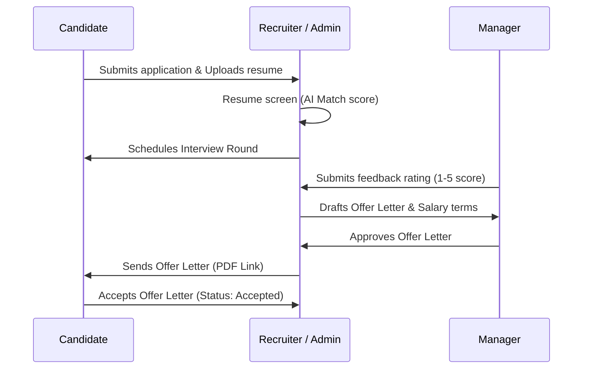
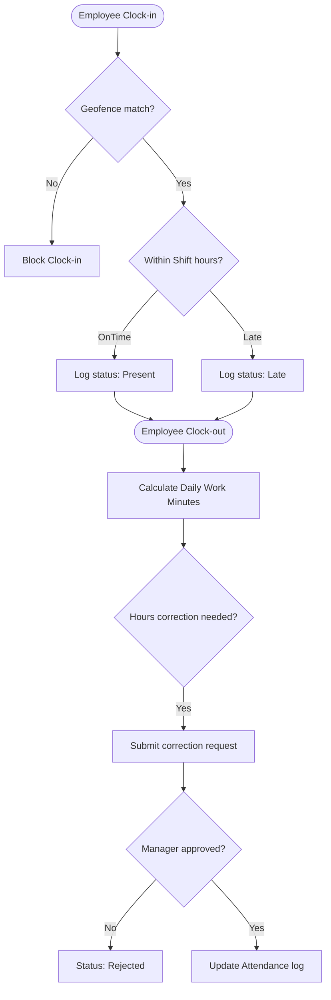
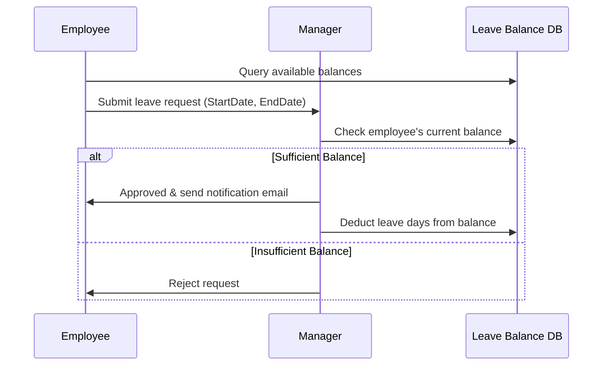
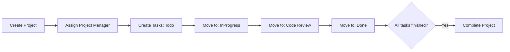
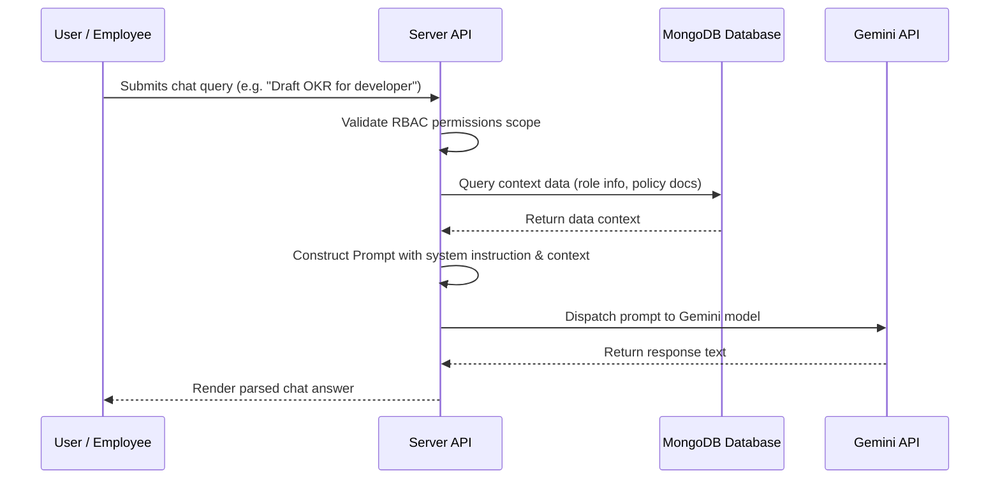

# Core Business Workflows Documentation

This document describes the operational workflows exactly as defined by the SRS. It contains step-by-step flows and Mermaid sequence diagrams for developer reference.

---

## 1. Recruitment Workflow
Manages candidates from application to the official offer letter.



---

## 2. Employee Lifecycle Workflow
Covers lifecycle stages from candidate conversion to onboarding and exit.

```text
[Candidate Offer Accepted] 
           │
           ▼
[Onboarding: Employee profile created automatically] 
           │
           ▼
[Profile Setup: Document verification (ID & Contract uploads)]
           │
           ▼
[Assignments: Department, Designation, Location, WorkShift allocated]
           │
           ▼
[Active Operations: Shift scheduling, attendance, leave cycles, monthly payroll]
           │
           ▼
[Annual Review: Appraisals, goal setting, rating feedback]
           │
           ▼
[Exit Lifecycle: Resignation submission, asset returns, exit survey, status: Terminated]
```

---

## 3. Attendance Workflow
Logs daily hours and manages manual correction requests.



---

## 4. Leave Approval Workflow
Ensures leave balance checks before time-off approval.



---

## 5. Payroll Workflow
Details the automated monthly calculations and payslip approvals.

```text
[Month Cutoff Date reached (e.g. 28th)]
           │
           ▼
[Gather unpaid leaves, late check-in deductions, and monthly allowances]
           │
           ▼
[System calculates Net Salary: Base + Allowances - Deductions]
           │
           ▼
[Payroll generated in status: Draft]
           │
           ▼
[OrgAdmin reviews and approves Payroll]
           │
           ▼
[Bank transfer export generated & Payslips status: Paid]
           │
           ▼
[Nodemailer dispatches payslip notifications to employee emails]
```

---

## 6. Performance Review Workflow
Tracks goal alignment (OKRs) and reviews.

1. **Goal Setting:** Manager sets annual goals (OKRs) for Employee. Status: `InProgress`.
2. **Progress Updates:** Employee updates progress percentages (0-100%) on milestones.
3. **Appraisal Initiation:** HR triggers review cycle. Manager assesses goal metrics.
4. **Appraisal Review:** Manager writes comments, selects rating (1.0-5.0), and submits evaluation.
5. **Acknowledgment:** Employee signs off review notes. Status: `Acknowledged`.

---

## 7. Project Management Workflow
Supports agile task assignments.



---

## 8. Help Desk Workflow
Service desk ticketing lifecycle.

1. **Submission:** Employee creates support ticket. System flags category and priority.
2. **Allocation:** System assigns to IT or HR staff agent. Status: `Assigned`.
3. **Resolution:** Agent investigates, changes state to `InProgress`, writes updates, and resolves ticket.
4. **Closure:** Employee receives alert and closes ticket.

---

## 9. AI Operations Assistant Workflow
Interactive prompts processing with database contexts.


